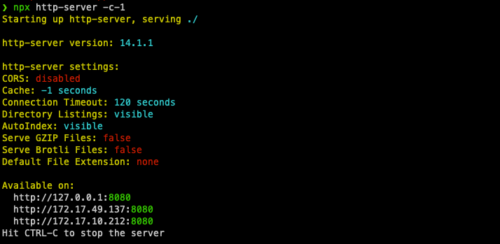

# Developer documentation


## Building


Building requires [Node.js](https://nodejs.org/en/) to be installed. 

Run sbt

    $ sbt

Once in sbt you will see the self explaining [SBT Welcome](https://github.com/reibitto/sbt-welcome) menu with shortcuts for common commands. 

Start by entering ```f``` which is a shortcut for ```~fastOptJS / webpack``` and will build and compile to javascript.

    sbt:sounds-of-scala> f

This will start the build process and you should see the following output:
    
        [info] Fast optimizing /home/<YOUR_HOME_AND_PATH>/sounds-of-scala/target/scala-3.1.0-RC1/sounds-of-scala-fastopt.js
        [success] Total time: 1 s, completed 23 Mar 2024, 08:10:04
        [info] 100. Monitoring source files for root/fastOptJS / webpack...
        [info]      Press <enter> to interrupt or '?' for more options.

Now that the project is compiled to javascript you need to run the index.html file in the js folder. You will need to use a server for this.

- You can do this by using [http-server](https://www.npmjs.com/package/http-server). To install http-server ```npm i http-server``` 
- To run the server ```cd js``` to navigate to js folder and then run ```npx http-server -c-1```. The -c-1 flag is to disable caching.
- You should get the following output showing you where you can view the app in your browser



Alternatively to run via your IDE:
- In VsCode you can use the [Live Server](https://marketplace.visualstudio.com/items?itemName=ritwickdey.LiveServer) extension.
- In IntelliJ you can use the built in server and simply navigate to the index.html file and right click and select "Open in Browser".