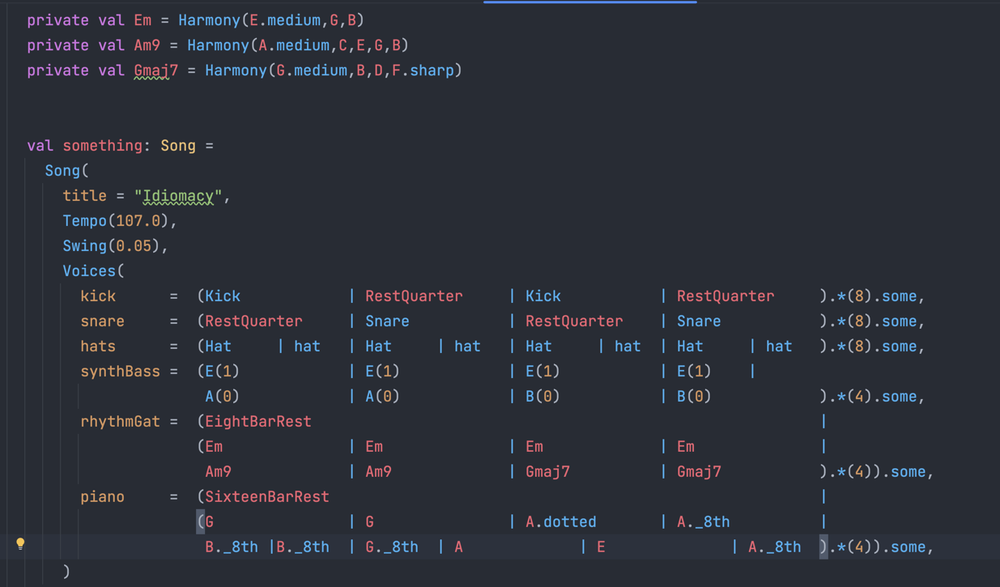

# Welcome to the Sounds of Scala project

## A Web Music & Audio library for Scala

The fastest way to make some sound emanate from your device is with the SimpleAudioPlayer.

Add the following to your build.sbt file:

```scala 3
libraryDependencies += "org.soundsofscala" %%% "sounds-of-scala" % "0.4.0"
```
Then in the code of your Scala.js project pass the path to an audio file to the SimpleAudioPlayer constructor.

```scala 3
val audioPlayer = SimpleAudioPlayer("<PATH_TO_LOCAL_AUDIO_FILE>")
audioPlayer.play()
audioPlayer.pause()
audioPlayer.play()
audioPlayer.stop()
```


### What are we doing?
Building a library that uses the web audio api to build music applications. 

### Who is the library for?
Musicians, Producers, You and anyone else who wants to use Scala to build Web Audio Apps.

### Why are we doing it?
Firstly.. music is awesome.. and fun.. and although people seldom describe it this way.. its very useful. 

Secondly.. Scala is also awesome.. but is currently without it's own Music and Audio library.

The idea of implementing a dedicated music and audio library on top of the [Web Audio Api](https://developer.mozilla.org/en-US/docs/Web/API/Web_Audio_API) for Scala originated with a presentation I gave at ScalaDays Madrid 2023.
For this presentation, I created a simple music DSL and POC of a web audio application using Scala.js to wrap a JavaScript library called [Tone.js](https://tonejs.github.io/) which also sits on top of the lower level Web Audio Api. 

In the time since the talk there has been enthusiasm to develop this Music library further and, instead of using Scala.js to wrap a JavaScript library, write something similar to Tone.js exclusively for Scala. 

Here is a link to my ScalaDays Madrid talk: [Sounds of Structure](https://www.youtube.com/watch?v=L4rf_QUD7nw&t=253s)

To run the Demo App follow the steps in the [DEVELOPING.md](./DEVELOPING.md) file.

### Examples of Web Audio Apps

Here are some links to references of the kinds of Applications we'll be able to build with this library.

[Groove Pizza](https://apps.musedlab.org/groovepizza/?museid=g-ynenctF&)

[DeepDrum](https://gogulilango.com/software/deep-drum)

[Tweakable](https://tweakable.org/)

[BandLab](https://www.bandlab.com/)


## How to get involved

Please join our Discord Chat for ongoing discussion: [#sounds-of-scala](https://discord.gg/g2vYRAUjVW)

Quickest way to get involved is just to join the Discord channel and say "Hi" and we can add you to the task board and you can pick up something to work on. 

We are looking for any contributions towards both the Music DSL specification, and building the audio mixer and controls.

* [Contributing guidelines](./CONTRIBUTING.md)
* [Developer documentation](./DEVELOPING.md)
* [I've found an issue](https://github.com/pauliamgiant/sounds-of-scala/issues)

### Technologies

We would like to focus on Functional Scala.

[Scala 3](https://scala-lang.org/api/3.x/)

[Scala.js](https://www.scala-js.org/)

[Typelevel Stack - Cats, CE3](https://typelevel.org/)

# RoadMap
1. Domain Specific Music Language - Develop the music DSL to allow composition of a melody and song.
2. Audio Engine - Utilise the Web Audio API to allow playing of audio samples and sequencing.
3. Build instruments and synthesizers.

### Example of the POC music DSL:



## Milestones
- Develop DSL - DSL can model a complete song with Notes, Rests, Bars, Chords
- Sampler and Sequencer - MVP Can load audio samples and play a simple melody in the browser
- Be able to compose a multi-voice song with Sampler and Sequencer
- Audio mixer controls for voices including Volume, Pan
- Add synthesizers
- Effects Processors i.e Reverb, Delay, Distortion, Compression
- Implement recording capabilities
- Enable Midi input device
- Spike using 3rd party plug ins and sound libraries

