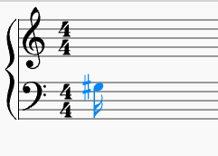

# MusicalEvent Syntax 


Below are some examples of the syntax provided by the `sounds-of-scala` library for generating MusicalEvents. This syntax is designed to make it easier to define notes, chords, and drum strokes.


### Quick Notes

Quick notes are defined for convenience. These can be used to quickly define commonly used notes.

```scala 3
    val A3: Note = A(Octave(3))
    val B3: Note = B(Octave(3))
    val C3: Note = C(Octave(3))
    val D3: Note = D(Octave(3))
    val E3: Note = E(Octave(3))
    val F3: Note = F(Octave(3))
    val G3: Note = G(Octave(3))
```

### Defining Accidental, Velocity, and Duration

Chaining properties onto a note using smart constructors. The below will produce a note with the properties:
- Pitch: G1 sharp 
- Duration: A sixteenth or semi-quaver
- Velocity: Medium  

```scala 3
G3.sharp.sixteenth.medium
```



### Quick Drums

A number of quick drum strokes are defined for convenience. These can be used to quickly define drum patterns.

```scala 3
val kk = DrumStroke(Kick, Quarter, Medium)
val sn = DrumStroke(Snare, Quarter, Medium)
val hhc = DrumStroke(HiHatClosed, Quarter, Medium)
val hho = DrumStroke(HiHatOpen, Quarter, Medium)
val cr = DrumStroke(Crash, Quarter, Medium)
val rd = DrumStroke(Ride, Quarter, Medium)
val t1 = DrumStroke(TomHigh, Quarter, Medium)
val t2 = DrumStroke(TomMid, Quarter, Medium)
val ft = DrumStroke(FloorTom, Quarter, Medium)
val clp = DrumStroke(Clap, Quarter, Loud)
val KickDrum = kk
val SnareDrum = sn
val HatsClosed = hhc
val HatsOpen = hho
val CrashCymbal = cr
val RideCymbal = rd
val Tom1 = t1
val Tom2 = t2
val Tom3 = ft
val HandClap = clp
```

### Defining Velocity, and Duration

Much the same as with notes, you can chain properties onto a drum stroke using smart constructors. The below will produce a drum stroke with the properties:

- Drum: Kick
- Duration: A whole note, aka 4 beats
- Velocity: Assertively

```scala 3
kk.whole.assertively
```

### Quick Chords

```scala 3
    val Cmaj: Harmony = Chord(C3, E3, G3)
    val Cmaj7: Harmony = Chord(C3, E3, G3, B3)
    val Cmaj9: Harmony = Chord(C3, E3, G3, B3, D4)
    val Cmaj11: Harmony = Chord(C3, E3, G3, B3, D4, F4)
    val Cmaj13: Harmony = Chord(C3, E3, G3, B3, D4, F4, A4)
```

### Quick Rests
```scala 3
    val RestWhole = Rest(Whole)
    val RestHalf = Rest(Half)
    val RestQuarter = Rest(Quarter)
    val RestEighth = Rest(Eighth)
    val RestSixteenth = Rest(Sixteenth)
    val RestThirtySecondth = Rest(ThirtySecond)
    val OneBarRest = RestWhole
    val TwoBarRest = OneBarRest + OneBarRest
    val FourBarRest = TwoBarRest + TwoBarRest
    val EightBarRest = FourBarRest + FourBarRest

    val r1 = RestWhole
    val r2 = RestHalf
    val r4 = RestQuarter
    val r8 = RestEighth
    val r16 = RestSixteenth
    val r32 = RestThirtySecondth
    val r64 = Rest(SixtyFourth)
    val r2triplet = Rest(HalfTriplet)
    val r4triplet = Rest(QuarterTriplet)
    val r8triplet = Rest(EighthTriplet)
    val r16triplet = Rest(SixteenthTriplet)
    val r32triplet = Rest(ThirtySecondTriplet)
```

### [Next Step: Syntax](../instruments/README.md)